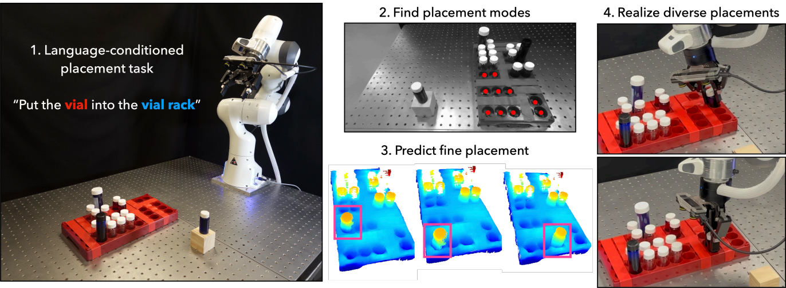

# AnyPlace: Learning Generalized Object Placement for Robot Manipulation

### [Website](https://any-place.github.io/) | [Paper](https://www.arxiv.org/abs/2502.04531) 

Object placement in robotic tasks is inherently challenging due to the diversity of object geometries and placement configurations. To address this, we propose AnyPlace, a two-stage method trained entirely on synthetic data, capable of predicting a wide range of feasible placement poses for real-world tasks. Our key insight is that by leveraging a Vision-Language Model (VLM) to identify rough placement locations, we focus only on the relevant regions for local placement, which enables us to train the low-level placement-pose-prediction model to capture diverse placements efficiently. 

[Yuchi Zhao](https://y556zhao.github.io/),
[Miroslav Bogdanovic](https://miroslavbogdanovic.super.site/),
[Chengyuan Luo](https://nicklcy.github.io/),
[Steven Tohme](https://steventohme.ca/),
[Kourosh Darvish](https://kouroshd.github.io/),
[Alán Aspuru-Guzik](https://www.matter.toronto.edu/basic-content-page/about-alan),
[Florian Shkurti](https://www.cs.toronto.edu/~florian/),
[Animesh Garg](https://animesh.garg.tech/)

<div align="center">
  
</div>

-----
## Code

We provide the official implementation of AnyPlace including:

1. Training AnyPlace low-level pose prediction models 
2. Evaluation pipeline in IsaacLab for executing pick and place
3. Interaction with AnyPlace high-level placement location prediction

### Installtion
Setup for AnyPlace Low-level Pose Prediction Models
1. Clone the repo and follow the instruction below:
```
conda create -n anyplace python=3.8
conda activate anyplace

pip install -r base_requirements.txt
pip install -e .
pip install torch==1.13.1+cu117 torchvision==0.14.1+cu117 torchaudio==0.13.1 --extra-index-url https://download.pytorch.org/whl/cu117
```

2. Install `torch-scatter`/`torch-cluster` / `knn_cuda` packages

```
pip install torch-scatter -f https://data.pyg.org/whl/torch-1.13.0+cu117.html --no-index
pip install torch-cluster -f https://data.pyg.org/whl/torch-1.13.0+cu117.html --no-index
pip install https://github.com/unlimblue/KNN_CUDA/releases/download/0.2/KNN_CUDA-0.2-py3-none-any.whl
```

3. Update and source the setup script to set environment variables 
```
source anyplace_env.sh
```

4. Follow instructions at [README.md](anyplace_molmo/README.md) to setup AnyPlace high-level pose location prediction.
5. Follow instructions at [README.md](anyplace_isaaclab_pick_place/README.md) to setup AnyPlace IsaacLab Pick and Place evaluation pipeline.


### Training
1. Download the AnyPlace synthetic dataset on [Huggingface](https://huggingface.co/datasets/yuchiallanzhao/anyplace).
2. Configure [wandb](https://docs.wandb.ai/quickstart/) on your machine.
3. Run the following commands to launch the single-task and multi-task training:
```
# for single-task training
cd training/
python train_full.py -c anyplace_cfgs/vial_inserting/anyplace_diffusion_molmocrop.yaml # config files for different tasks can be found under config/train_cfgs/anyplace_cfgs

# for multi-task training
cd training/
python train_full.py -c anyplace_cfgs/multitask/anyplace_diffusion_molmocrop_mt.yaml 
```

### Evaluation
For evaluation, first obtain the predicted placement poses by running AnyPlace models, then execute the predicted placements using our IsaacLab Pick and Place pipeline.

#### Placement Pose Prediction
1. Setup the meshcat visualizer to visualize the object pointclouds at each diffusion step
```
meshcat-server   # use port 7000 by default
```
2. Download the AnyPlace evaluation dataset on [Huggingface](https://huggingface.co/datasets/yuchiallanzhao/anyplace), which contains object USD files, RGBD images and object pointclouds.
3. Update file path in config files and then run the AnyPlace model by:
```
cd eval/
python evaluate_official.py -c anyplace_eval/vial_inserting/anyplace_diffusion_molmocrop_multitask.yaml # config files for different tasks can be found under config/full_eval_cfgs/anyplace_eval
```
4. To visualize pointclouds at their final predicted placement poses, first update the data folder path in the ['visualize_placement.py'](anyplace_model/eval/visualize_placement.py) and then run:
```
cd eval/
python visualize_placement.py
```
#### IsaacLab Pick and Place Evaluation
Follow instruction [here](anyplace_isaaclab_pick_place/README.md) to run the AnyPlace IsaacLab Pick and Place evaluation pipeline.

#### Checkpoints
Model checkpoints can also be downloaded on [Huggingface](https://huggingface.co/datasets/yuchiallanzhao/anyplace).

### Inference with AnyPlace high-level pose location prediction
coming soon......

-----
## License
This repository is released under the MIT license. See [LICENSE](LICENSE) for additional details.

## Acknowledgements

We would like to thank the authors for their contributions to these repositories and appreciate their efforts in open-sourcing their work:

- [RPDiff](https://github.com/anthonysimeonov/rpdiff)
- [Implicit-PDF](https://github.com/google-research/google-research/tree/master/implicit_pdf)
- [Molmo](https://github.com/allenai/molmo)
- [SAM-2](https://github.com/facebookresearch/sam2)

## Citation

```
@misc{zhao2025anyplacelearninggeneralizedobject,
      title={AnyPlace: Learning Generalized Object Placement for Robot Manipulation}, 
      author={Yuchi Zhao and Miroslav Bogdanovic and Chengyuan Luo and Steven Tohme and Kourosh Darvish and Alán Aspuru-Guzik and Florian Shkurti and Animesh Garg},
      year={2025},
      eprint={2502.04531},
      archivePrefix={arXiv},
      primaryClass={cs.RO},
      url={https://arxiv.org/abs/2502.04531}, 
}
```
